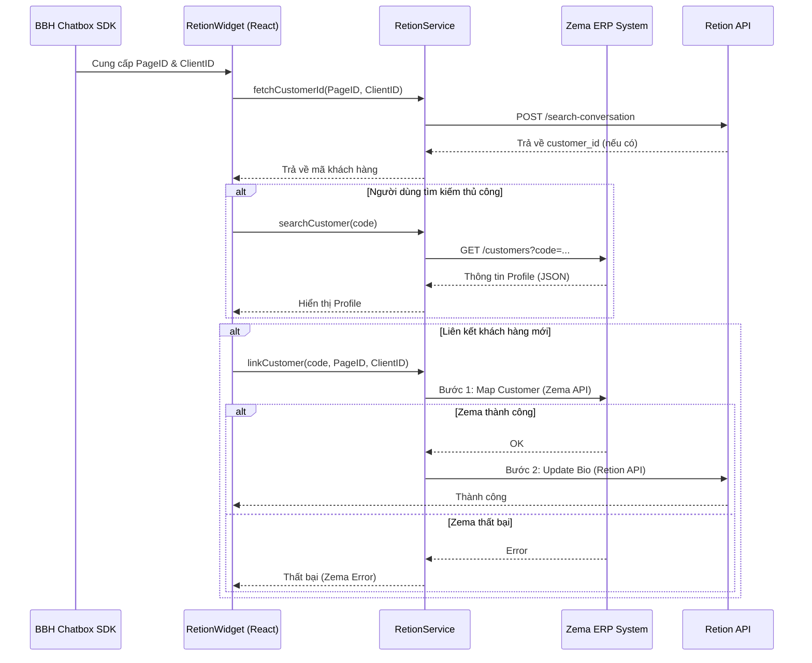

# Tài liệu Kỹ thuật: Module Retion Widget Integration

Tài liệu này mô tả chi tiết cấu trúc, logic xử lý và luồng dữ liệu của module **Retion Widget**. Đây là một thành phần quan trọng trong hệ thống ERP ChatBot, cho phép nhân viên tư vấn nhận diện và liên kết khách hàng đang chat với dữ liệu thực tế trên hệ thống ERP (Zema).

---

## 1. Tổng quan kiến trúc (Architecture Overview)

Hệ thống được chia thành hai lớp chính để đảm bảo tính phân tách trách nhiệm (Separation of Concerns):

| Thành phần | Vai trò | Công nghệ/Thư viện |
|:---|:---|:---|
| **`RetionWidget.tsx`** | Lớp giao diện (View Layer). Xử lý tương tác người dùng, hiển thị trạng thái loading, lỗi và thông tin khách hàng. | React, Lucide Icons, TailwindCSS |
| **`RetionService.ts`** | Lớp nghiệp vụ (Service Layer). Thực hiện các cuộc gọi API đến Retion và ERP, xử lý logic mapping và giả lập dữ liệu (Mocking). | TypeScript, Fetch API |

---

## 2. Chi tiết Component: `RetionWidget.tsx`

### 2.1. Quản lý trạng thái (State Management)
Component sử dụng các `useState` để quản lý giao diện động:
- `search_code`: Lưu trữ mã khách hàng do người dùng nhập hoặc lấy tự động từ SDK.
- `found_customer`: Chứa đối tượng khách hàng (`Customer`) được trả về từ ERP.
- `is_searching` / `is_initializing`: Quản lý trạng thái loading để tối ưu trải nghiệm (UX).
- `current_page_id` / `current_client_id`: Định danh duy nhất của cuộc hội thoại từ Facebook/Zalo.

### 2.2. Luồng khởi tạo (Initialization Flow)
1. **Kết nối SDK**: Sử dụng `useEffect` để đăng ký sự kiện `WIDGET.onEvent`. Khi admin chuyển tab hoặc thay đổi khách hàng chat, Widget sẽ tự động cập nhật thông tin.
2. **Giải mã thông tin**: Hàm `getConversationInfo` sử dụng `WIDGET.decodeClient()` hoặc `WIDGET.getClientInfo()` để trích xuất `fb_page_id` và `fb_client_id`.
3. **Cơ chế Fallback**: Nếu chạy ngoài môi trường chatbox (ví dụ Test local), hệ thống sẽ tự động lấy ID từ URL Params (`fb_page_id`, `fb_client_id`) sau 1.5 giây.

### 2.3. Các phương thức xử lý chính
| Hàm | Giải thích |
|:---|:---|
| `autoFetchConversationInfo` | Tự động gọi API Retion để kiểm tra xem khách hàng này đã từng được liên kết với mã ERP nào chưa. Nếu có, tự động điền và tìm kiếm thông tin. |
| `handleSearch` | Truy vấn thông tin chi tiết (Tên, SĐT, Điểm tích lũy...) từ hệ thống ERP thông qua mã khách hàng. |
| `handleLink` | Thực hiện quy trình liên kết 2 bước (Map dữ liệu ERP và Cập nhật Bio Bio cho Retion) để ghi nhớ thông tin khách hàng cho các lần chat sau. |

---

## 3. Chi tiết Service: `RetionService.ts`

Service này đóng vai trò là cầu nối (Bridge) giữa giao diện và các hệ thống Backend phức tạp.

### 3.1. Chế độ Giả lập (Mock Mode)
Để hỗ trợ việc phát triển nhanh mà không cần phụ thuộc vào API thật, Service hỗ trợ cờ `is_mock`. Khi được bật (thông qua URL `?mode=test`), Service sẽ:
- Trả về dữ liệu từ file `mockData.ts`.
- Tạo độ trễ nhân tạo (`setTimeout`) để giả lập độ trễ mạng thực tế.

### 3.2. Các Endpoint API quan trọng
- **Retion Conversation Query**: Tìm kiếm mã khách hàng đã lưu trong `client_bio`.
- **ERP Search API**: Lấy Profile khách hàng từ hệ thống Zema.
- **Retion Mapping API**: Lưu trữ mối quan hệ giữa `client_id` và `customer_code`.
- **Bio Update API**: Cập nhật thông tin hiển thị trực tiếp trên dashboard của Retion.

---

## 4. Luồng dữ liệu (Data Flow Diagram)



---

## 5. Quy tắc đặt tên và Coding Convention

Module tuân thủ nghiêm ngặt các quy tắc lập trình sau:
- **Biến thông thường/State**: Sử dụng `lower_snake_case` (ví dụ: `search_code`, `is_searching`).
- **Hằng số/Instance**: Sử dụng `UPPER_SNAKE_CASE` (ví dụ: `RETION_SERVICE`, `PAGE_ID`).
- **Function/Method**: Sử dụng `camelCase` (ví dụ: `handleSearch`, `fetchCustomerId`).
- **Class/Interface**: Sử dụng `PascalCase` (ví dụ: `RetionService`, `IProps`).
- **Chú thích**: 100% bằng tiếng Việt, giải thích rõ "Làm cái gì" và "Tại sao".

---

## 6. Cấu hình môi trường (Environment Variables)

Yêu cầu các biến sau trong file `.env`:
```bash
VITE_RETION_CONVERSATION_API_URL=...
VITE_RETION_MAP_API_URL=...
VITE_RETION_UPDATE_CONVERSATION_API_URL=...
VITE_ZEMA_API_URL=...
VITE_ZEMA_API_TOKEN=...
VITE_ZEMA_API_PRODUCT=...
```

> [!IMPORTANT]
> Luôn đảm bảo rằng các Token API được bảo mật và không được đẩy trực tiếp lên source control công khai.
